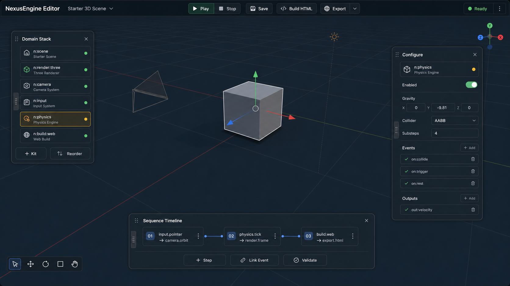

# Start Here

Status: active

## Purpose

This `.agent` workspace is the handoff layer for turning NexusEngine Editor from the current static proof shell into a usable 3D game-engine editor.

## Read First

1. `workflow.md`
2. `intention.md`
3. `memory.md`
4. `goal.md`
5. `goal-packets/001-3d-domain-service-kit-editor.md`
6. `goal-packets/005-manifest-driven-sequence-events.md`
7. `goal-packets/006-scene-outliner-bulk-authoring.md`
8. `goal-packets/007-project-persistence-snapshots.md`
9. `goal-packets/008-bulk-domain-kit-assignment.md`
10. `goal-packets/009-large-scene-windowing.md`
11. `goal-packets/010-sequence-playback-receipts.md`
12. `goal-packets/011-scene-authoring-presets.md`
13. `goal-packets/012-scalable-html-runtime.md`
14. `goal-packets/013-build-profile-controls.md`
15. `goal-packets/014-project-file-portability.md`
16. `goal-packets/015-sequence-step-inspector.md`
17. `goal-packets/016-editor-viewport-culling.md`
18. `goal-packets/017-visible-registry-kit-dropdown.md`
19. `goal-packets/018-viewport-tool-actions.md`
20. `goal-packets/019-game-template-authoring.md`
21. `goal-packets/020-exported-sequence-controls.md`
22. `goal-packets/021-runtime-interaction-kit.md`
23. `game-loop-progress.md`
24. `game-loop-retrospective.md`
25. `completion-audit.md`
26. `runtime-interaction-implementation-handoff.md`
27. `runtime-interaction-validation-matrix.md`
28. `feedback.md`
29. `feedback-packets/001-viewport-first-3d-editor.md`

## Visual Target

Reference image:

