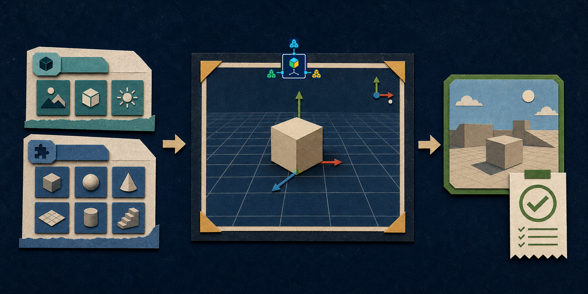

# NexusEngine Editor



NexusEngine Editor is a static, viewport-first 3D web editor for composing
Domain Service Kit projects and exporting browser-playable HTML.

[Open the public editor](https://luminarylabs-dev.github.io/NexusEngine-Editor/)

Project format `0.4.0` stores an accepted
`nexusengine.composition-tree/1` plus a metadata-only
`nexusengine.composition-registry/3` project overlay. Flat authoring views are
derived from that accepted tree for templates, CLI commands, snapshots, and
exports.

## What It Provides

- A native WebGL viewport kept primary across desktop and compact layouts.
- Docked Game Structure, Inspector, and Behaviors workspaces with no persistent overlays.
- Registry-backed Domain and Kit composition with staged, atomic Apply.
- Scene objects, transforms, camera controls, presets, templates, sequences, and receipts.
- Single-file DSK HTML builds and standalone playable-project exports.
- CLI operations for inspection, validation, templates, kit installation, and export.
- Opt-in MCP servers for editor diagnostics, composition, and an isolated game runtime.
- An Editor-owned, file-backed nine-stage Headless host for Node integrations.

## Engine Compatibility

The browser and Node toolchain target the same exact NexusEngine `0.0.4`
candidate:

```txt
58fa721db73992d77d6866b282494a559f0ec13c
```

The browser module URL is immutable:

```txt
https://cdn.jsdelivr.net/gh/LuminaryLabs-Dev/NexusEngine@58fa721db73992d77d6866b282494a559f0ec13c/src/index.js
```

Until that commit is pushed, the CDN request fails closed. Local proof injects
the exact installed Engine package from the same origin:

```txt
http://127.0.0.1:<port>/index.html?engine=/node_modules/nexusengine/src/index.js
```

`package.json` records the Engine commit, registry hash, and packed-artifact
hash. `package-lock.json` installs that commit without a sibling checkout or
symlink.

## Quick Start

The validation and deployment workflow uses Node.js 22.

```bash
npm ci
npm test
npm run build
```

The static site is written to `dist/`. Build the starter single-file game with:

```bash
npm run build:game
```

## Editor Workflow

```text
select registered Domains and Kits
  -> stage composition changes
    -> validate the complete draft
      -> Apply atomically
        -> preview, play, save, or export
```

Dirty or invalid drafts disable Run Once, Play, and Build. Browser users can
add registered references, but code and registry-package installation remain
CLI-only. Imported manifest-only Kits do not receive executable trust.

## CLI

```bash
npm run cli -- status
npm run cli -- templates
npm run cli -- operations list
npm run cli -- operations describe playable-export
npm run cli -- operations submit playable-export --param input_project=/path/game.project.json --param output_dir=dist/games/my-game
npm run cli:chess
npm run cli:target-clicker
npm run cli:gem-collector
```

`playable-export` handles projects carrying a
`nexusengine.playable-project/1` descriptor. It writes a standalone folder,
rejects unsafe paths and symlinks, and records export fingerprints.

Node hosts can import the Editor-owned Headless host:

```js
import { createHeadlessEditorHarness } from "@luminarylabs/nexusengine-editor/headless";
```

The host owns:

```text
read -> capture-before -> plan -> validate -> submit
  -> observe -> verify -> capture-after -> observed-differences
```

NexusEngine Core remains limited to reusable contracts and composition atoms.

## MCP Boundaries

```bash
npm run mcp:screenshot
npm run mcp:game
```

The editor MCP server exposes status, screenshot-backed diagnostics, registry
discovery, stable composition planning, and approved composition application.
File writes and `composition_apply` fail closed unless the server process has
`NEXUS_EDITOR_MCP_ALLOW_WRITES=1`.

Apply receipts and executable fingerprints persist in the project. Repeating
the same plan, including after process restart, returns the original receipt
without reinstalling. Changed contents behind an existing Kit ID fail before
project mutation.

The separate game MCP runtime is not installed into normal Editor exports. Its
state-changing tool requires `NEXUS_GAME_MCP_ALLOW_ACTIONS=1`.

## Architecture Map

- `src/editor-domain-model.js`: project, scene, sequence, template, and export data.
- `src/editor-composition.js`: migration, staged edits, validation, preview, and Play.
- `src/editor-composition-mcp.js`: Core Composition bridge and persisted receipts.
- `src/nexus-engine-editor-runtime.js`: ordered Editor Kits and bindings.
- `src/editor-kit-registry.js`: Kit manifests and registry snapshots.
- `src/headless/index.js`: Node-only file-backed Headless Editor host.
- `src/viewport-webgl.js`: dependency-free WebGL viewport.
- `src/dsk-html-builder.js`: browser/Node single-file game builder.
- `scripts/nexus-engine-editor-cli.mjs`: project and export operations.

## Documentation

- [Documentation map](./docs/README.md)
- [Architecture](./docs/ARCHITECTURE.md)
- [Operations](./docs/OPERATIONS.md)
- [Visual identity](./docs/VISUAL-IDENTITY.md)
- [Contributing](./CONTRIBUTING.md)
- [Security](./SECURITY.md)
- [Changelog](./CHANGELOG.md)

## Validation And Deployment

```bash
npm test
```

The test command runs intent and MCP replay checks, the static build, and the
Playwright Editor matrix. GitHub Pages deployment is manual-only through
`workflow_dispatch`; source pushes do not publish the Editor.

## License

No license file is currently present. Public repository visibility does not by
itself grant permission to copy, modify, or redistribute the code.
